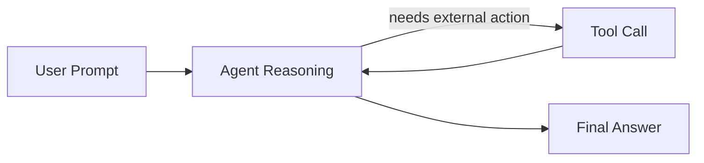
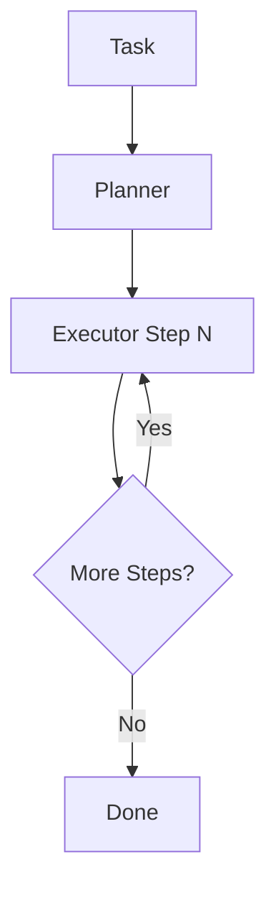
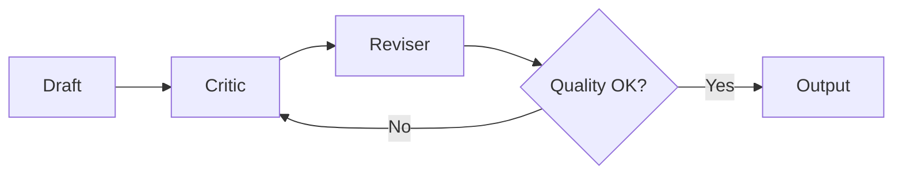
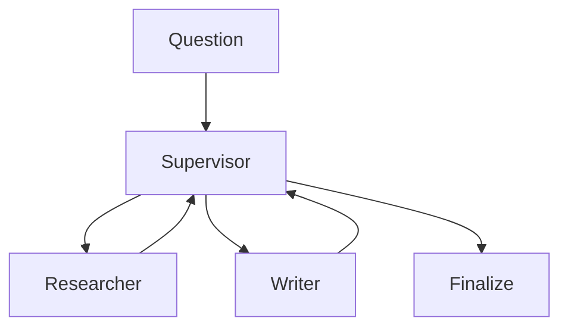
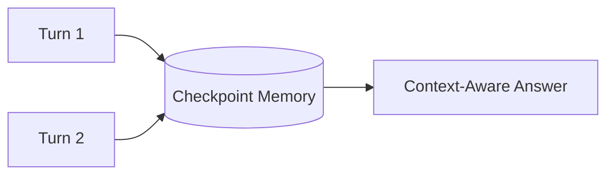
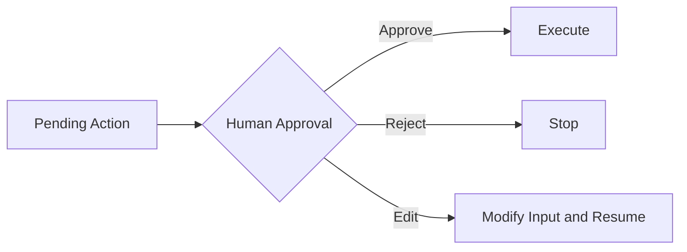
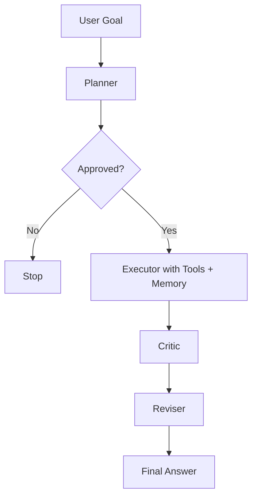
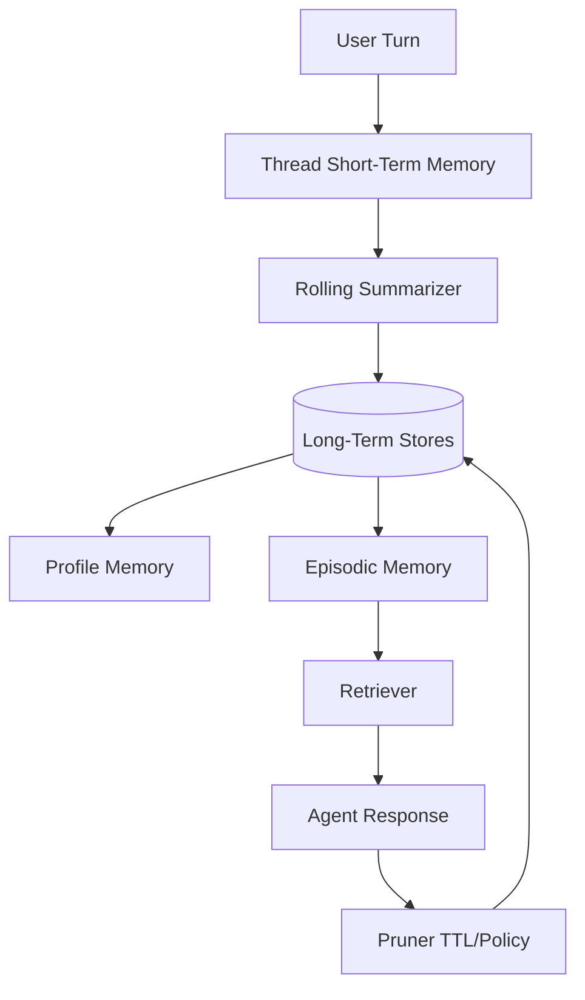

# Agentic AI Patterns with Ollama (`qwen3.5:2b`)

This workspace contains Jupyter notebooks demonstrating agentic AI patterns using local Ollama and LangGraph.

## What You Learn

- How to build tool-using agents with current LangChain APIs.
- How to orchestrate planning, execution, reflection, memory, and approval workflows.
- How to keep everything local using Ollama (`qwen3.5:2b`).

## Notebooks

1. `01_react_tool_agent.ipynb` - ReAct tool-using agent
2. `02_planner_executor_graph.ipynb` - planner/executor decomposition
3. `03_reflection_critic_loop.ipynb` - reflection and revision loop
4. `04_multi_agent_supervisor.ipynb` - supervisor routing across specialist agents
5. `05_memory_enabled_agent.ipynb` - memory across turns using thread-scoped checkpoints
6. `06_human_in_the_loop.ipynb` - approval gate with static interruption and resume
7. `07_capstone_agentic_patterns.ipynb` - composed end-to-end workflow using multiple patterns
8. `08_memory_management_patterns.ipynb` - practical memory management strategies and code examples

## Pattern Explanations

### 1) ReAct Tool-Using Agent

- The agent decides when to call tools (calculator/time) and when to respond directly.
- Use this when tasks require selective function calling.



### 2) Planner -> Executor

- A planner decomposes a task into explicit steps.
- The executor iterates through those steps until completion.



### 3) Reflection / Critic Loop

- Draft output is critiqued and then revised.
- Improves quality for explanations, reports, and summaries.



### 4) Multi-Agent Supervisor

- A supervisor routes work to specialist agents (researcher/writer).
- Scales cleanly as responsibilities grow.



### 5) Memory-Enabled Agent

- Uses thread-scoped state so context persists across turns.
- Different thread IDs isolate different conversations.



### 6) Human-in-the-Loop Approval

- Workflow pauses before a sensitive/expensive step.
- Human can approve, reject, or modify before resume.



### 7) Capstone Composition

- One graph combines planning, approval gate, tool execution, critique, and revision.
- Best reference notebook for building practical local agentic systems.



### 8) Memory Management Patterns

- Shows five memory strategies: thread memory, rolling summaries, profile memory, episodic retrieval, and pruning.
- Useful when your agent needs both personalization and bounded context cost.



## Research References (Peer-Reviewed, APA Style)

The mappings below use peer-reviewed venues only (ICLR, NeurIPS, ACL, ICML, Nature).

1. ReAct Tool-Using Agent
- Yao, S., Zhao, J., Yu, D., Du, N., Shafran, I., Narasimhan, K., & Cao, Y. (2023). ReAct: Synergizing reasoning and acting in language models. In The Eleventh International Conference on Learning Representations (ICLR). https://openreview.net/forum?id=WE_vluYUL-X
- Schick, T., Dwivedi-Yu, J., Dessec, R., Raileanu, R., Lomeli, M., Hambro, E., Zettlemoyer, L., Cancedda, N., & Scialom, T. (2023). Toolformer: Language models can teach themselves to use tools. In Advances in Neural Information Processing Systems (NeurIPS), 36. https://proceedings.neurips.cc/paper_files/paper/2023/hash/d842425e4bf79ba039352da0f658a906-Abstract-Conference.html

2. Planner -> Executor
- Zhou, D., Scharli, N., Hou, L., Wei, J., Scales, N., Wang, X., Schuurmans, D., Bousquet, O., Le, Q. V., & Chi, E. H. (2023). Least-to-most prompting enables complex reasoning in large language models. In The Eleventh International Conference on Learning Representations (ICLR). https://openreview.net/forum?id=WZH7099tgfM
- Yao, S., Yu, D., Zhao, J., Shafran, I., Griffiths, T. L., Cao, Y., & Narasimhan, K. (2023). Tree of thoughts: Deliberate problem solving with large language models. In Advances in Neural Information Processing Systems (NeurIPS), 36. https://proceedings.neurips.cc/paper_files/paper/2023/hash/271db9922b8d1f4dd7aaef84ed5ac703-Abstract-Conference.html

3. Reflection / Critic Loop
- Wang, X., Wei, J., Schuurmans, D., Le, Q. V., Chi, E. H., Narang, S., Chowdhery, A., & Zhou, D. (2023). Self-consistency improves chain of thought reasoning in language models. In The Eleventh International Conference on Learning Representations (ICLR). https://openreview.net/forum?id=1PL1NIMMrw
- Yao, S., Yu, D., Zhao, J., Shafran, I., Griffiths, T. L., Cao, Y., & Narasimhan, K. (2023). Tree of thoughts: Deliberate problem solving with large language models. In Advances in Neural Information Processing Systems (NeurIPS), 36. https://proceedings.neurips.cc/paper_files/paper/2023/hash/271db9922b8d1f4dd7aaef84ed5ac703-Abstract-Conference.html

4. Multi-Agent Supervisor
- Lowe, R., Wu, Y., Tamar, A., Harb, J., Abbeel, P., & Mordatch, I. (2017). Multi-agent actor-critic for mixed cooperative-competitive environments. In Advances in Neural Information Processing Systems (NeurIPS), 30. https://proceedings.neurips.cc/paper/2017/hash/68a9750337a418a86fe06c1991a1d64c-Abstract.html
- Rashid, T., Samvelyan, M., De Witt, C. S., Farquhar, G., Foerster, J., Whiteson, S., & Nardelli, N. (2018). QMIX: Monotonic value function factorisation for deep multi-agent reinforcement learning. In Proceedings of the 35th International Conference on Machine Learning (ICML), 80, 4295-4304. https://proceedings.mlr.press/v80/rashid18a.html

5. Memory-Enabled Agent
- Sukhbaatar, S., Weston, J., Fergus, R., et al. (2015). End-to-end memory networks. In Advances in Neural Information Processing Systems (NeurIPS), 28. https://proceedings.neurips.cc/paper/2015/hash/8fb21ee7a2207526da55a679f0332de2-Abstract.html
- Dai, Z., Yang, Z., Yang, Y., Carbonell, J. G., Le, Q. V., & Salakhutdinov, R. (2019). Transformer-XL: Attentive language models beyond a fixed-length context. In Proceedings of the 57th Annual Meeting of the Association for Computational Linguistics (ACL), 2978-2988. https://aclanthology.org/P19-1285/

6. Human-in-the-Loop Approval
- Christiano, P. F., Leike, J., Brown, T., Martic, M., Legg, S., & Amodei, D. (2017). Deep reinforcement learning from human preferences. In Advances in Neural Information Processing Systems (NeurIPS), 30. https://proceedings.neurips.cc/paper/2017/hash/d5e2c0adad503c91f91df240d0cd4e49-Abstract.html
- Stiennon, N., Ouyang, L., Wu, J., Ziegler, D. M., Lowe, R., Voss, C., Radford, A., Amodei, D., & Christiano, P. F. (2020). Learning to summarize with human feedback. In Advances in Neural Information Processing Systems (NeurIPS), 33, 3008-3021. https://proceedings.neurips.cc/paper/2020/hash/1f89885d556929e98d3ef9b86448f951-Abstract.html

7. Capstone Composition
- Lewis, P., Perez, E., Piktus, A., Petroni, F., Karpukhin, V., Goyal, N., Kuttler, H., Lewis, M., Yih, W.-t., Rocktaschel, T., Riedel, S., & Kiela, D. (2020). Retrieval-augmented generation for knowledge-intensive NLP tasks. In Advances in Neural Information Processing Systems (NeurIPS), 33, 9459-9474. https://proceedings.neurips.cc/paper/2020/hash/6b493230205f780e1bc26945df7481e5-Abstract.html
- Yao, S., Zhao, J., Yu, D., Du, N., Shafran, I., Narasimhan, K., & Cao, Y. (2023). ReAct: Synergizing reasoning and acting in language models. In The Eleventh International Conference on Learning Representations (ICLR). https://openreview.net/forum?id=WE_vluYUL-X
- Schick, T., Dwivedi-Yu, J., Dessec, R., Raileanu, R., Lomeli, M., Hambro, E., Zettlemoyer, L., Cancedda, N., & Scialom, T. (2023). Toolformer: Language models can teach themselves to use tools. In Advances in Neural Information Processing Systems (NeurIPS), 36. https://proceedings.neurips.cc/paper_files/paper/2023/hash/d842425e4bf79ba039352da0f658a906-Abstract-Conference.html

8. Memory Management Patterns
- Rae, J. W., Potapenko, A., Jayakumar, S. M., & Lillicrap, T. P. (2020). Compressive transformers for long-range sequence modelling. In The Eighth International Conference on Learning Representations (ICLR). https://openreview.net/forum?id=SylKikSYDH
- Dai, Z., Yang, Z., Yang, Y., Carbonell, J. G., Le, Q. V., & Salakhutdinov, R. (2019). Transformer-XL: Attentive language models beyond a fixed-length context. In Proceedings of the 57th Annual Meeting of the Association for Computational Linguistics (ACL), 2978-2988. https://aclanthology.org/P19-1285/
- Khandelwal, U., Levy, O., Jurafsky, D., Zettlemoyer, L., & Lewis, M. (2020). Generalization through memorization: Nearest neighbor language models. In The Eighth International Conference on Learning Representations (ICLR). https://openreview.net/forum?id=HklBjCEKvH

## Environment

A virtual environment was created at `.venv` and packages were installed.

If you want to run manually in terminal:

```powershell
c:/Anil/AgenticPatterns/.venv/Scripts/python.exe -m ipykernel install --user --name agenticpatterns --display-name "Python (AgenticPatterns)"
c:/Anil/AgenticPatterns/.venv/Scripts/python.exe -m jupyter lab
```

## Ollama

Ensure Ollama is running and model exists:

```powershell
ollama list
```

Expected model in this project: `qwen3.5:2b`

## Notes

- All notebooks use local model calls via `langchain-ollama`.
- Agent construction uses `langchain.agents.create_agent` (current API in LangChain 1.2.x).
- If a notebook is slow, reduce prompt complexity or iterations.
- Mermaid diagrams above render in GitHub and many Markdown viewers; they act as lightweight pattern visuals inside this README.

