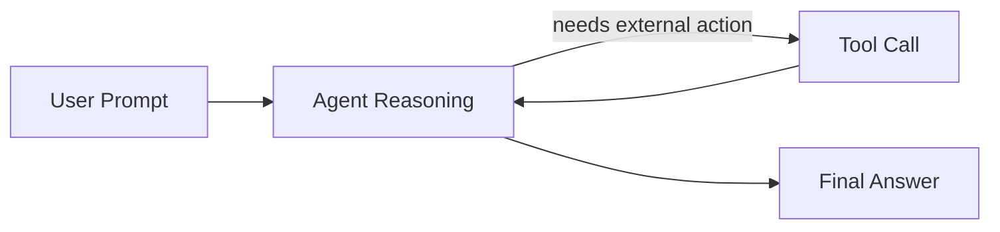
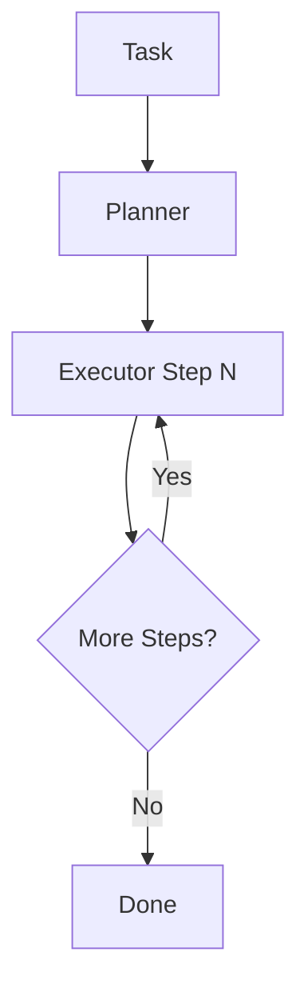
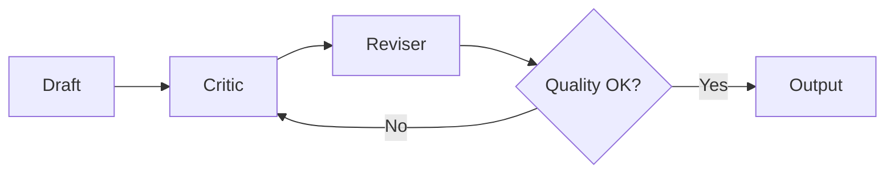
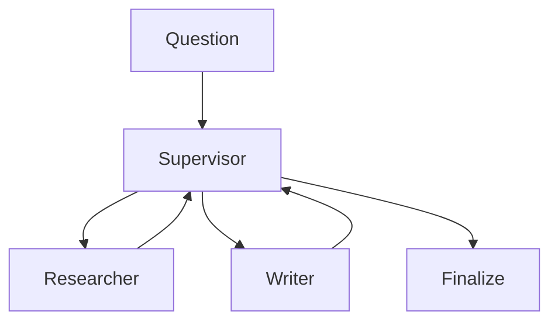
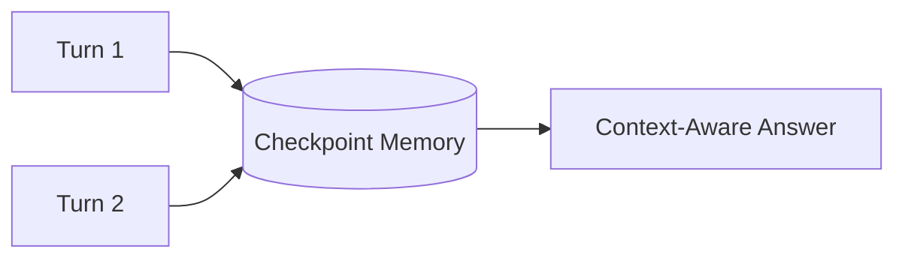
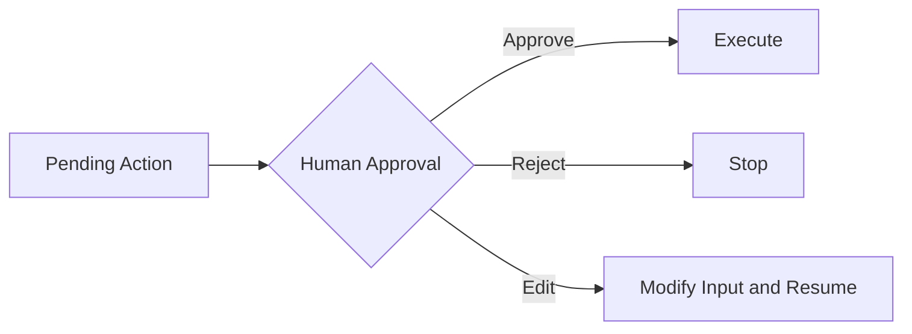
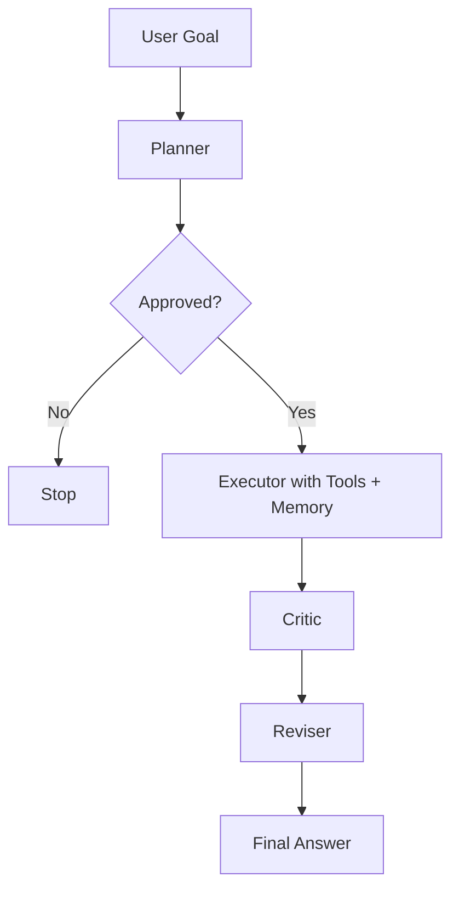
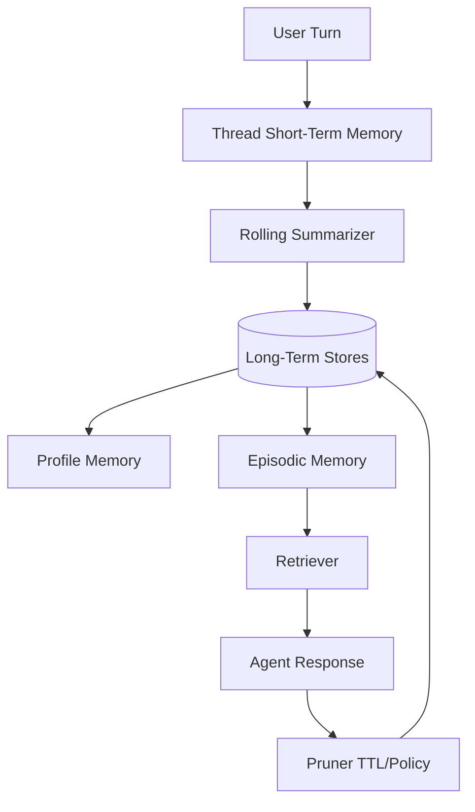

# Agentic AI Patterns with Ollama (`qwen3.5:2b`)

This workspace contains Jupyter notebooks demonstrating agentic AI patterns using local Ollama and LangGraph.

## What You Learn

- How to build tool-using agents with current LangChain APIs.
- How to orchestrate planning, execution, reflection, memory, and approval workflows.
- How to keep everything local using Ollama (`qwen3.5:2b`).

## Notebooks

1. `01_react_tool_agent.ipynb` - ReAct tool-using agent
2. `02_planner_executor_graph.ipynb` - planner/executor decomposition
3. `03_reflection_critic_loop.ipynb` - reflection and revision loop
4. `04_multi_agent_supervisor.ipynb` - supervisor routing across specialist agents
5. `05_memory_enabled_agent.ipynb` - memory across turns using thread-scoped checkpoints
6. `06_human_in_the_loop.ipynb` - approval gate with static interruption and resume
7. `07_capstone_agentic_patterns.ipynb` - composed end-to-end workflow using multiple patterns
8. `08_memory_management_patterns.ipynb` - practical memory management strategies and code examples

## Pattern Explanations

### 1) ReAct Tool-Using Agent

- The agent decides when to call tools (calculator/time) and when to respond directly.
- Use this when tasks require selective function calling.



### 2) Planner -> Executor

- A planner decomposes a task into explicit steps.
- The executor iterates through those steps until completion.



### 3) Reflection / Critic Loop

- Draft output is critiqued and then revised.
- Improves quality for explanations, reports, and summaries.



### 4) Multi-Agent Supervisor

- A supervisor routes work to specialist agents (researcher/writer).
- Scales cleanly as responsibilities grow.



### 5) Memory-Enabled Agent

- Uses thread-scoped state so context persists across turns.
- Different thread IDs isolate different conversations.



### 6) Human-in-the-Loop Approval

- Workflow pauses before a sensitive/expensive step.
- Human can approve, reject, or modify before resume.



### 7) Capstone Composition

- One graph combines planning, approval gate, tool execution, critique, and revision.
- Best reference notebook for building practical local agentic systems.



### 8) Memory Management Patterns

- Shows five memory strategies: thread memory, rolling summaries, profile memory, episodic retrieval, and pruning.
- Useful when your agent needs both personalization and bounded context cost.



## Environment

A virtual environment was created at `.venv` and packages were installed.

If you want to run manually in terminal:

```powershell
c:/Anil/AgenticPatterns/.venv/Scripts/python.exe -m ipykernel install --user --name agenticpatterns --display-name "Python (AgenticPatterns)"
c:/Anil/AgenticPatterns/.venv/Scripts/python.exe -m jupyter lab
```

## Ollama

Ensure Ollama is running and model exists:

```powershell
ollama list
```

Expected model in this project: `qwen3.5:2b`

## Notes

- All notebooks use local model calls via `langchain-ollama`.
- Agent construction uses `langchain.agents.create_agent` (current API in LangChain 1.2.x).
- If a notebook is slow, reduce prompt complexity or iterations.
- Mermaid diagrams above render in GitHub and many Markdown viewers; they act as lightweight pattern visuals inside this README.
